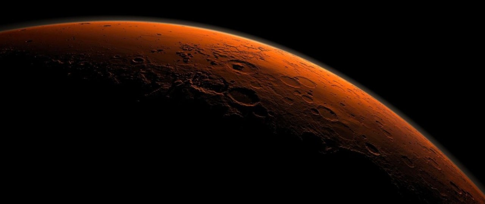

# Mission to Mars - Web Scraping with HTML/CSS

## Project Overview

## Resources
- **Data Sources**: https://mars.nasa.gov/news/
- **Software and Tools**: Python, Pandas, ChromeDriver, Splinter, BeautifulSoup, HTML/CSS, MongoDB, Flask, Bootstrap, Jupyter Notebook, VS Code & Git Bash 

## Challenge Overview
A junior data scientist, Robin, does freelance astronomy work in her spare time. Her dream is to land a position with NASA someday, so she spends a lot of time visiting sites with news about space exploration, especially the Mission to Mars. She decides to write a python script to gather data about the Mission to Mars from all over the web and display it in a central location without spending her fee time gathering the data manually. After Robin scrapes the data, she stores it in a MongoDB database since she's downloading tables, paragraphs and images. Then, she built a web application using Flask to interface with her python script and Mongo database and display the results. She's customized it using HTML and CSS and made it capable of scraping new data every time she tells it to with a click of a button. If her web app is polished enough, it may even get NASA's attention.

## Challenge Results
Robin's web app is looking good and functioning well, but she wants to add more polish to it. I'll help her revise the python script to scrape all four of Mars' hemispheres images and include them on her web app.

### Deliverable 1: Scrape High-Resolution Mars Hemisphere Images and Titles
I used BeautifulSoup and Splinter to scrape full-resolution images of Mars' hemispheres and the titles of those images and stored them to the Mongo database. I created a list of dictionaries called `hemisphere_image_urls` to store the scraped image URL string and title for each hemisphere, as shown in the screenshot below: 

### Deliverable 2: Update the Web App with Mars Hemisphere Images and Titles
I copied the code from Deliverable 1 to scrape the hemisphere images and titles and used it to create a new function called  `mars_hemispheres` in my `scraping.py` file, as shown below, and added the scraped data to the Mongo database:

Next, I ran the `app.py` file with the modified `index.html` file and clicked the "Scrape New Data" button. After the scrape runs, the web app displays the full-resolution images and titles of the four hemisphere images, as shown below:

### Deliverable 3: Add Bootstrap 3 Components
1. I updated the `index.html` file to make the website mobile-responsive.
2. I added a CSS stylesheet and added html to improve the website design as follows:
    - I added a backround image for the top header.
    - I made the scrape button color red.
    - I changed the background color to slate gray.
    - I made the background color of the Mars Facts table light gray.
    - I changed the text color to white for many elements so they would pop against the dark background color.

## Challenge Summary
I think Robin's web app is looking polished now; it should get NASA's attention!
