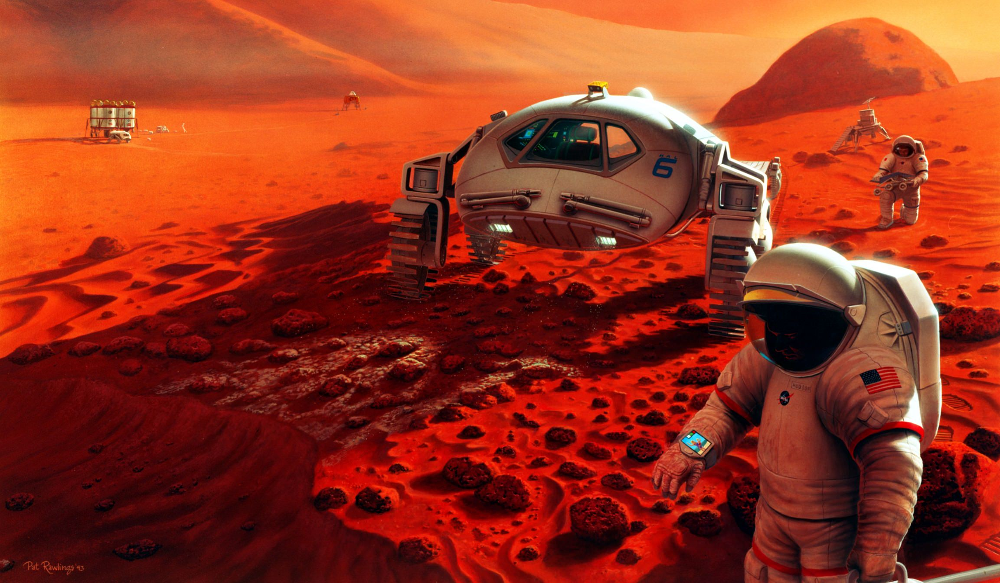

# Mission to Mars - Web Scraping with HTML/CSS

## Project Overview

## Resources
- **Data Sources**: https://mars.nasa.gov/news/
- **Software and Tools**: Python, Pandas, ChromeDriver, Splinter, BeautifulSoup, HTML, MongoDB, Flask, Bootstrap, Jupyter Notebook, VS Code & Git Bash 

## Challenge Overview

## Challenge Results
### Deliverable 1: Scrape High-Resolution Mars Hemisphere Images and Titles

### Deliverable 2: Update the Web App with Mars Hemisphere Images and Titles

### Deliverable 3: Add Bootstrap 3 Components

## Challenge Summary
